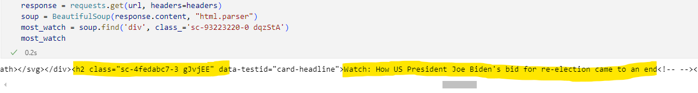

# webscraping

* how to find div string (take example of BBC)
    * we want to find most watch news, first we need to go to BBC, and find the 'most watch' section, then right click and click ```Inspect```. Then the screen looks like: , highlighted part is the string of div.
    * then find results with div string, and print out, find out the news related string: 
    * then can print out all headings: 

* get all div / h2/ img/ p: bbc_news_scraping.ipynb